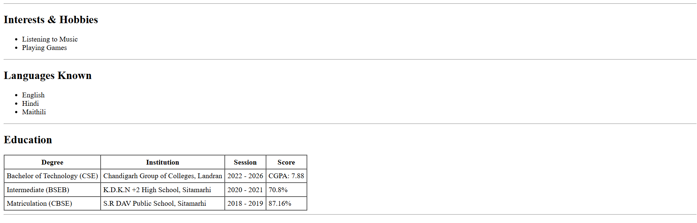
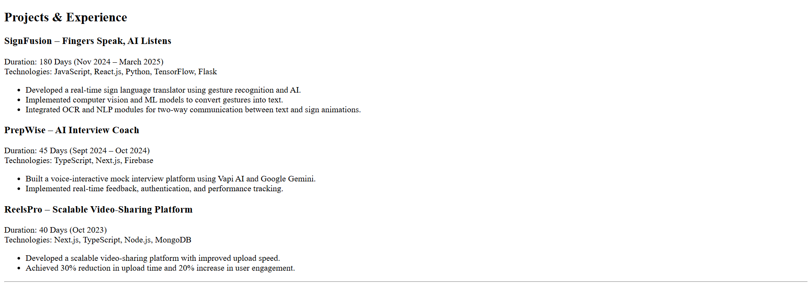

## 📌 Assignment Overview
Web Dev Cohort 2026 – HTML Assignment

This project is a **single-page resume website** created using **only HTML**.  
No CSS or JavaScript has been used, as per the assignment instructions.

## 🛠️ Technologies Used

- HTML5 only 

## ▶️ How to Run the Project

1. Clone the repository or download the files
2. Open the `index.html` file
3. Run it in any web browser

```bash
open index.html
````

(or double-click the file)

---

## 📷 Demo

* Live Website: *https://resumeforwebdev.vercel.app/*
## 📷 Screenshots






---

## 📂 Repository Structure

```
.
├── index.html
└── README.md
```
## 👤 Author

**Himanshu Kumar**

* LinkedIn: [https://www.linkedin.com/in/himazing](https://www.linkedin.com/in/himazing)
* GitHub: [https://github.com/Himazing](https://github.com/Himazing)
* Portfolio: [https://himanshu-portfolio-tau.vercel.app](https://himanshu-portfolio-tau.vercel.app)


## 📜 License

This project is created for **educational purposes only**.

© 2026 Himanshu Kumar. All rights reserved.

**Built with ❤️ as part of Web Dev Cohort 2026**
